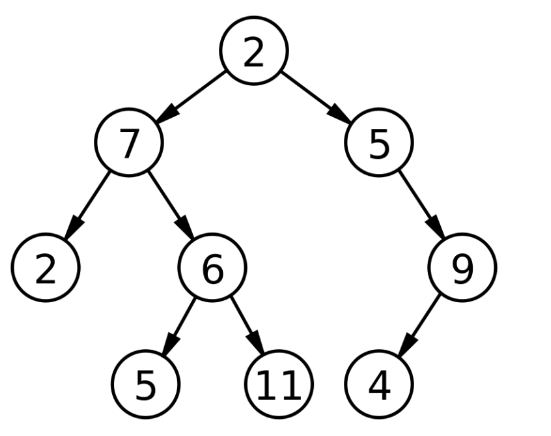

# Binary Tree

Tree represents the nodes connected by edges. It is a non-linear data structure. It has the following properties −

- One node is marked as Root node.
- Every node other than the root is associated with one parent node.
- Each node can have an arbiatry number of chid node.



```python
class Node:
   def __init__(self, data):
      self.left = None
      self.right = None
      self.data = data
   def PrintTree(self):
      print(self.data)

root = Node(10)
root.PrintTree()
```

### ****Inserting into a Tree****

```python
def insert(self, data):
# Compare the new value with the parent node
      if self.data:
         if data < self.data:
            if self.left is None:
               self.left = Node(data)
            else:
               self.left.insert(data)
            elif data > self.data:
               if self.right is None:
                  self.right = Node(data)
               else:
                  self.right.insert(data)
      else:
         self.data = data
```

### ****Traversing a Tree****

The tree can be traversed by deciding on a sequence to visit each node. As we can clearly see we can start at a node then visit the left sub-tree first and right sub-tree next. Or we can also visit the right sub-tree first and left sub-tree next. Accordingly there are different names for these tree traversal methods.

****In-order Traversal****

In this traversal method, the left subtree is visited first, then the root and later the right sub-tree. We should always remember that every node may represent a subtree itself.

```python
# Inorder traversal
# Left -> Root -> Right
   def inorderTraversal(self, root):
      res = []
      if root:
         res = self.inorderTraversal(root.left)
         res.append(root.data)
         res = res + self.inorderTraversal(root.right)
      return res
```

****Pre-order Traversal****

In this traversal method, the root node is visited first, then the left subtree and finally the right subtree.

```python
# Preorder traversal
# Root -> Left ->Right
   def PreorderTraversal(self, root):
      res = []
      if root:
         res.append(root.data)
         res = res + self.PreorderTraversal(root.left)
         res = res + self.PreorderTraversal(root.right)
      return res
```

### **Post-order Traversal**

In this traversal method, the root node is visited last, hence the name. First, we traverse the left subtree, then the right subtree and finally the root node.

```python
# Postorder traversal
# Left ->Right -> Root
def PostorderTraversal(self, root):
res = []
if root:
res = self.PostorderTraversal(root.left)
res = res + self.PostorderTraversal(root.right)
res.append(root.data)
return res
```