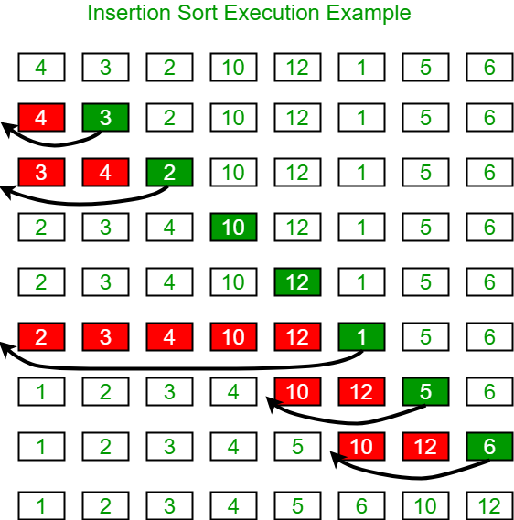
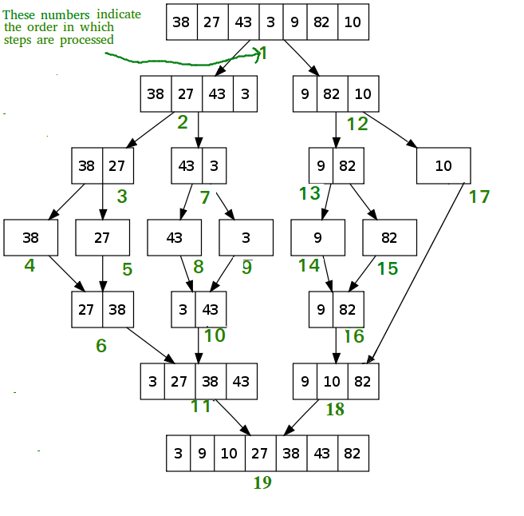

# Sorting Algorithms

Sorting refers to arranging data in a particular format. Sorting algorithm specifies the way to arrange data in a particular order. Most common orders are in numerical or lexicographical order.

The importance of sorting lies in the fact that data searching can be optimized to a very high level, if data is stored in a sorted manner. Sorting is also used to represent data in more readable formats. Below we see five such implementations of sorting in python.

- Bubble Sort
- Selection Sort
- Insertion Sort
- Merge Sort
- Shell Sort

## ****Bubble Sort****

It is a comparison-based algorithm in which each pair of adjacent elements is compared and the elements are swapped if they are not in order. o(n²)

```python
def bubblesort(list):

# Swap the elements to arrange in order
   for iter_num in range(len(list)-1,0,-1):
      for idx in range(iter_num):
         if list[idx]>list[idx+1]:
            temp = list[idx]
            list[idx] = list[idx+1]
            list[idx+1] = temp
list = [19,2,31,45,6,11,121,27]
bubblesort(list)
print(list)
```

## **Selection Sort**

The **selection sort algorithm** sorts an array by repeatedly finding the minimum element (considering ascending order) from the unsorted part and putting it at the beginning. **(O(n²))**

```python
def selection_sort(input_list):
   for idx in range(len(input_list)):
      min_idx = idx
      for j in range( idx +1, len(input_list)):
         if input_list[min_idx] > input_list[j]:
         min_idx = j
# Swap the minimum value with the compared value
   input_list[idx], input_list[min_idx] = input_list[min_idx], input_list[idx]
l = [19,2,31,45,30,11,121,27]
selection_sort(l)
print(l)
```

## **Insertion Sort**

**Insertion sort** is a simple sorting algorithm that works similar to the way you sort playing cards in your hands. The array is virtually split into a sorted and an unsorted part. Values from the unsorted part are picked and placed at the correct position in the sorted part.



```python
def insertion_sort(InputList):
   for i in range(1, len(InputList)):
      j = i-1
      nxt_element = InputList[i]
# Compare the current element with next one
   while (InputList[j] > nxt_element) and (j >= 0):
      InputList[j+1] = InputList[j]
      j=j-1
   InputList[j+1] = nxt_element
list = [19,2,31,45,30,11,121,27]
insertion_sort(list)
print(list)
```

## **Merge Sort**

The **Merge Sort** algorithm is a sorting algorithm that is based on the **Divide and Conquer** paradigm. In this algorithm, the array is initially divided into two equal halves and then they are combined in a sorted manner. **O(N log(N))**

**Algorithm**

*step 1: start* 

*step 2: declare array and left, right, mid variable*

*step 3: perform merge function.*   

 *if left > right    return*    

*mid= (left+right)/2* 

*mergesort(array, left, mid)*   

*mergesort(array, mid+1, right)*    

*merge(array, left, mid, right)*

*step 4: Stop*



```python
def merge_sort(unsorted_list):
   if len(unsorted_list) <= 1:
      return unsorted_list
# Find the middle point and devide it
   middle = len(unsorted_list) // 2
   left_list = unsorted_list[:middle]
   right_list = unsorted_list[middle:]

   left_list = merge_sort(left_list)
   right_list = merge_sort(right_list)
   return list(merge(left_list, right_list))
# Merge the sorted halves
def merge(left_half,right_half):
   res = []
   while len(left_half) != 0 and len(right_half) != 0:
      if left_half[0] < right_half[0]:
         res.append(left_half[0])
         left_half.remove(left_half[0])
      else:
         res.append(right_half[0])
         right_half.remove(right_half[0])
   if len(left_half) == 0:
      res = res + right_half
   else:
      res = res + left_half
   return res
```