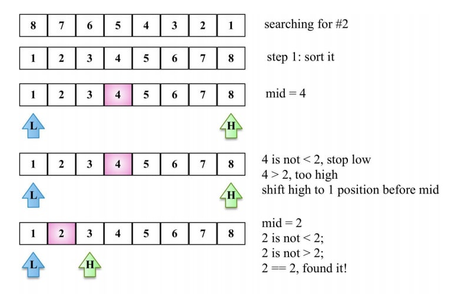

# Searching Algorithms

Searching is a very basic necessity when you store data in different data structures. The simplest approach is to go across every element in the data structure and match it with the value you are searching for.This is known as Linear search. It is inefficient and rarely used, but creating a program for it gives an idea about how we can implement some advanced search algorithms.

### **Linear Search**

In this type of search, a sequential search is made over all items one by one. Every item is checked and if a match is found then that particular item is returned, otherwise the search continues till the end of the data structure.

```python
def linear_search(values, search_for):
   search_at = 0
   search_res = False
# Match the value with each data element
   while search_at < len(values) and search_res is False:
      if values[search_at] == search_for:
         search_res = True
      else:
         search_at = search_at + 1
   return search_res
l = [64, 34, 25, 12, 22, 11, 90]
print(linear_search(l, 12))
print(linear_search(l, 91))
```

### ****Interpolation Search****

This search algorithm works on the probing position of the required value. For this algorithm to work properly, the data collection should be in a sorted form and equally distributed.Initially, the probe position is the position of the middle most item of the collection.If a match occurs, then the index of the item is returned.If the middle item is greater than the item, then the probe position is again calculated in the sub-array to the right of the middle item. Otherwise, the item is searched in the subarray to the left of the middle item. This process continues on the sub-array as well until the size of subarray reduces to zero.



```python
def intpolsearch(values,x ):
   idx0 = 0
   idxn = (len(values) - 1)
   while idx0 <= idxn and x >= values[idx0] and x <= values[idxn]:
# Find the mid point
			mid = idx0 +\
		      int(((float(idxn - idx0)/( values[idxn] - values[idx0]))
		      * ( x - values[idx0])))
		# Compare the value at mid point with search value
		   if values[mid] == x:
		      return "Found "+str(x)+" at index "+str(mid)
		   if values[mid] < x:
		      idx0 = mid + 1
	  return "Searched element not in the list"

l = [2, 6, 11, 19, 27, 31, 45, 121]
print(intpolsearch(l, 2))
```