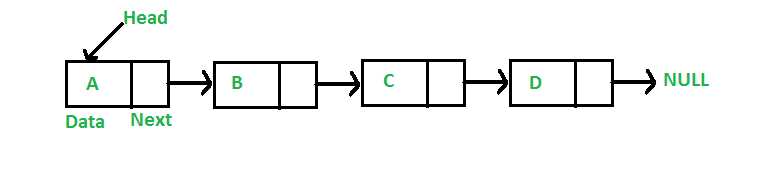

# Linked List

linear data structure, in which the elements are not stored at contiguous memory locations. The elements in a linked list are linked using pointers as shown in the below image:



A linked list is represented by a pointer to the first node of the linked list. The first node is called the head. If the linked list is empty, then the value of the head is NULL. Each node in a list consists of at least two parts:

- Data
- Pointer (Or Reference) to the next node

```python
class Node:
   def __init__(self, dataval=None):
      self.dataval = dataval
      self.nextval = None

class SLinkedList:
   def __init__(self):
      self.headval = None

list1 = SLinkedList()
list1.headval = Node("Mon")
e2 = Node("Tue")
e3 = Node("Wed")
# Link first Node to second node
list1.headval.nextval = e2

# Link second Node to third node
e2.nextval = e
```

**Linked List Traversal**

```python
class Node:
   def __init__(self, dataval=None):
      self.dataval = dataval
      self.nextval = None

class SLinkedList:
   def __init__(self):
      self.headval = None

   def listprint(self):
      printval = self.headval
      while printval is not None:
         print (printval.dataval)
         printval = printval.nextval

list = SLinkedList()
list.headval = Node("Mon")
e2 = Node("Tue")
e3 = Node("Wed")

# Link first Node to second node
list.headval.nextval = e2

# Link second Node to third node
e2.nextval = e3

list.listprint()
```

**Output**

```python
Mon
Tue
Wed
```

### ****Insertion in a Linked List****

Inserting element in the linked list involves reassigning the pointers from the existing nodes to the newly inserted node. Depending on whether the new data element is getting inserted at the beginning or at the middle or at the end of the linked list, we have the below scenarios.

**Inserting at the Beginning**

This involves pointing the next pointer of the new data node to the current head of the linked list. So the current head of the linked list becomes the second data element and the new node becomes the head of the linked list.

```python
def AtBegining(self,newdata):
      NewNode = Node(newdata)
			NewNode.nextval = self.headval
			self.headval = NewNode

list.AtBegining("Sun")
list.listprint()
```

```python
Sun
Mon
Tue
Wed
```

****Inserting at the End****

This involves pointing the next pointer of the the current last node of the linked list to the new data node. So the current last node of the linked list becomes the second last data node and the new node becomes the last node of the linked list.

```python
def AtEnd(self, newdata):
      NewNode = Node(newdata)
      if self.headval is None:
         self.headval = NewNode
         return
      laste = self.headval
      while(laste.nextval):
         laste = laste.nextval
      laste.nextval=NewNode
list = SLinkedList()
list.headval = Node("Mon")
e2 = Node("Tue")
e3 = Node("Wed")

list.headval.nextval = e2
e2.nextval = e3

list.AtEnd("Thu")

list.listprint()
```

```python
Mon
Tue
Wed
Thu
```

****Inserting in between two Data Nodes****

This involves changing the pointer of a specific node to point to the new node. That is possible by passing in both the new node and the existing node after which the new node will be inserted. So we define an additional class which will change the next pointer of the new node to the next pointer of middle node. Then assign the new node to next pointer of the middle node.

```python
def Inbetween(self,middle_node,newdata):
      if middle_node is None:
         print("The mentioned node is absent")
         return

      NewNode = Node(newdata)
      NewNode.nextval = middle_node.nextval
      middle_node.nextval = NewNode

list = SLinkedList()
list.headval = Node("Mon")
e2 = Node("Tue")
e3 = Node("Thu")

list.headval.nextval = e2
e2.nextval = e3

list.Inbetween(list.headval.nextval,"Fri")

list.listprint()
```

```python
Mon
Tue
Fri
Thu
```

****Removing an Item****

We can remove an existing node using the key for that node. In the below program we locate the previous node of the node which is to be deleted.Then, point the next pointer of this node to the next node of the node to be deleted.

```python
class Node:
   def __init__(self, data=None):
      self.data = data
      self.next = None
class SLinkedList:
   def __init__(self):
      self.head = None

   def Atbegining(self, data_in):
      NewNode = Node(data_in)
      NewNode.next = self.head
      self.head = NewNode

# Function to remove node
   def RemoveNode(self, Removekey):
      HeadVal = self.head

      if (HeadVal is not None):
         if (HeadVal.data == Removekey):
            self.head = HeadVal.next
            HeadVal = None
            return
      while (HeadVal is not None):
         if HeadVal.data == Removekey:
            break
         prev = HeadVal
         HeadVal = HeadVal.next

      if (HeadVal == None):
         return

      prev.next = HeadVal.next
         HeadVal = None

   def LListprint(self):
      printval = self.head
      while (printval):
         print(printval.data),
         printval = printval.next

llist = SLinkedList()
llist.Atbegining("Mon")
llist.Atbegining("Tue")
llist.Atbegining("Wed")
llist.Atbegining("Thu")
llist.RemoveNode("Tue")
llist.LListprint()
```

```
Thu
Wed
Mon

```