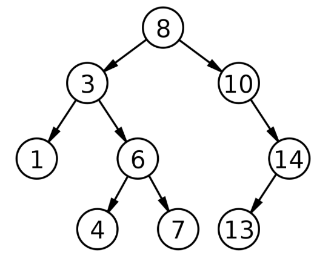

# Search tree

A Binary Search Tree (BST) is a tree in which all the nodes follow the below-mentioned properties.The left sub-tree of a node has a key less than or equal to its parent node's key.The right sub-tree of a node has a key greater than to its parent node's key.Thus, BST divides all its sub-trees into two segments; the left sub-tree and the right sub-tree

```
left_subtree (keys)  ≤  node (key)  ≤  right_subtree (keys)
```


****Search for a value in a B-tree****

Searching for a value in a tree involves comparing the incoming value with the value exiting nodes. Here also we traverse the nodes from left to right and then finally with the parent. If the searched for value does not match any of the exiting value, then we return not found message, or else the found message is returned.

```python
class Node:
   def __init__(self, data):
      self.left = None
      self.right = None
      self.data = data
# Insert method to create nodes
   def insert(self, data):
      if self.data:
         if data < self.data:
            if self.left is None:
               self.left = Node(data)
            else:
               self.left.insert(data)
            else data > self.data:
               if self.right is None:
                  self.right = Node(data)
               else:
                  self.right.insert(data)
         else:
            self.data = data
# findval method to compare the value with nodes
   def findval(self, lkpval):
      if lkpval < self.data:
         if self.left is None:
            return str(lkpval)+" Not Found"
         return self.left.findval(lkpval)
       else if lkpval > self.data:
            if self.right is None:
               return str(lkpval)+" Not Found"
            return self.right.findval(lkpval)
        else:
            print(str(self.data) + ' is found')
# Print the tree
   def PrintTree(self):
      if self.left:
         self.left.PrintTree()
      print( self.data),
      if self.right:
         self.right.PrintTree()
root = Node(12)
root.insert(6)
root.insert(14)
root.insert(3)
print(root.findval(7))
print(root.findval(14))
```

```
7 Not Found
14 is found
```