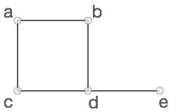

# Graphs

A graph is a pictorial representation of a set of objects where some pairs of objects are connected by links. The interconnected objects are represented by points termed as vertices, and the links that connect the vertices are called edges.

A graph can be easily presented using the python dictionary data types. We represent the vertices as the keys of the dictionary and the connection between the vertices also called edges as the values in the dictionary.



In the above graph,

```
V = {a, b, c, d, e}
E = {ab, ac, bd, cd, de}
```

We can present this graph in a python program as below −

```python
# Create the dictionary with graph elements
graph = {
   "a" : ["b","c"],
   "b" : ["a", "d"],
   "c" : ["a", "d"],
   "d" : ["e"],
   "e" : ["d"]
}
# Print the graph
print(graph)
```

When the above code is executed, it produces the following result −

```
{'c': ['a', 'd'], 'a': ['b', 'c'], 'e': ['d'], 'd': ['e'], 'b': ['a', 'd']}
```

****Display graph vertices****

To display the graph vertices we simple find the keys of the graph dictionary. We use the keys() method.

```python
class graph:
   def __init__(self,gdict=None):
      if gdict is None:
         gdict = []
      self.gdict = gdict
# Get the keys of the dictionary
   def getVertices(self):
      return list(self.gdict.keys())
# Create the dictionary with graph elements
graph_elements = {
   "a" : ["b","c"],
   "b" : ["a", "d"],
   "c" : ["a", "d"],
   "d" : ["e"],
   "e" : ["d"]
}
g = graph(graph_elements)
print(g.getVertices())
```

When the above code is executed, it produces the following result −

```
['d', 'b', 'e', 'c', 'a']
```

****Display graph edges****

Finding the graph edges is little tricker than the vertices as we have to find each of the pairs of vertices which have an edge in between them. So we create an empty list of edges then iterate through the edge values associated with each of the vertices. A list is formed containing the distinct group of edges found from the vertices.

```python
def findedges(self):
      edgename = []
      for vrtx in self.gdict:
         for nxtvrtx in self.gdict[vrtx]:
            if {nxtvrtx, vrtx} not in edgename:
               edgename.append({vrtx, nxtvrtx})
      return edgename

graph_elements = { 
   "a" : ["b","c"],
   "b" : ["a", "d"],
   "c" : ["a", "d"],
   "d" : ["e"],
   "e" : ["d"]
}
g = graph(graph_elements)
print(g.edges())
```

When the above code is executed, it produces the following result −

```
[{'b', 'a'}, {'b', 'd'}, {'e', 'd'}, {'a', 'c'}, {'c', 'd'}]
```

****Adding a vertex****

Adding a vertex is straight forward where we add another additional key to the graph dictionary.

```python
 def addVertex(self, vrtx):
      if vrtx not in self.gdict:
         self.gdict[vrtx] = []
graph_elements = { 
   "a" : ["b","c"],
   "b" : ["a", "d"],
   "c" : ["a", "d"],
   "d" : ["e"],
   "e" : ["d"]
}
g = graph(graph_elements)
g.addVertex("f")
print(g.getVertices())
```

When the above code is executed, it produces the following result −

```
['f', 'e', 'b', 'a', 'c','d']
```

****Adding an edge****

Adding an edge to an existing graph involves treating the new vertex as a tuple and validating if the edge is already present. If not then the edge is added.

```python
def AddEdge(self, edge):
      edge = set(edge)
      (vrtx1, vrtx2) = tuple(edge)
      if vrtx1 in self.gdict:
         self.gdict[vrtx1].append(vrtx2)
      else:
         self.gdict[vrtx1] = [vrtx2]
```