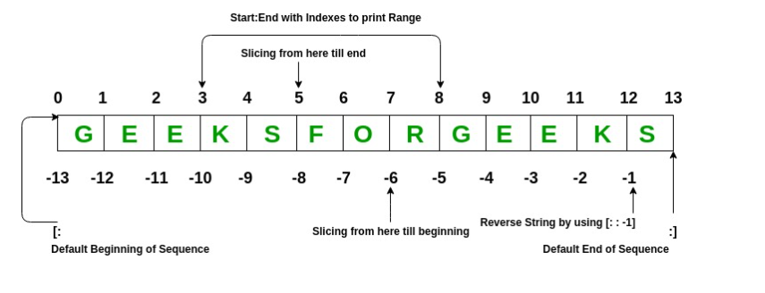

# Lists

```python
List = [1, 2,  3, "GFG", 2.3]
print(List)

>> [1, 2, 3, 'GFG', 2.3]
```

List elements can be accessed by the assigned index. In python starting index of the list, sequence is 0 and the ending index is (if N elements are there) N-1.



```python
# Creating a List with
# the use of multiple values
List = ["Geeks", "For", "Geeks"]
print("\nList containing multiple values: ")
print(List)

>> List containing multiple values: 
>> ['Geeks', 'For', 'Geeks']

# Creating a Multi-Dimensional List
# (By Nesting a list inside a List)
List2 = [['Geeks', 'For'], ['Geeks']]
print("\nMulti-Dimensional List: ")
print(List2)

>> Multi-Dimensional List: 
>> [['Geeks', 'For'], ['Geeks']]

# accessing a element from the 
# list using index number
print("Accessing element from the list")
print(List[0]) 
print(List[2])

>> Accessing element from the list
>> Geeks
>> Geeks
# accessing a element using
# negative indexing
print("Accessing element using negative indexing")
     
# print the last element of list
print(List[-1])
     
# print the third last element of list 
print(List[-3])

>> Accessing element using negative indexing
>> Geeks
>> Geeks
```